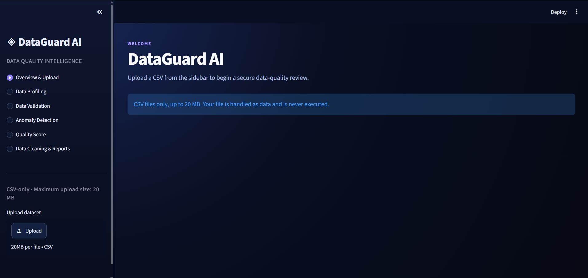
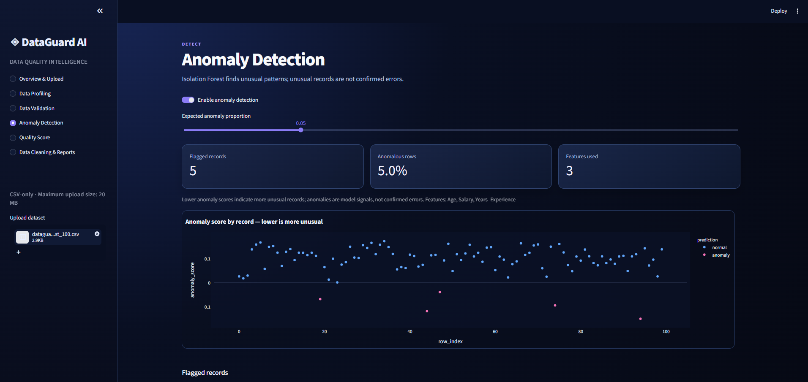
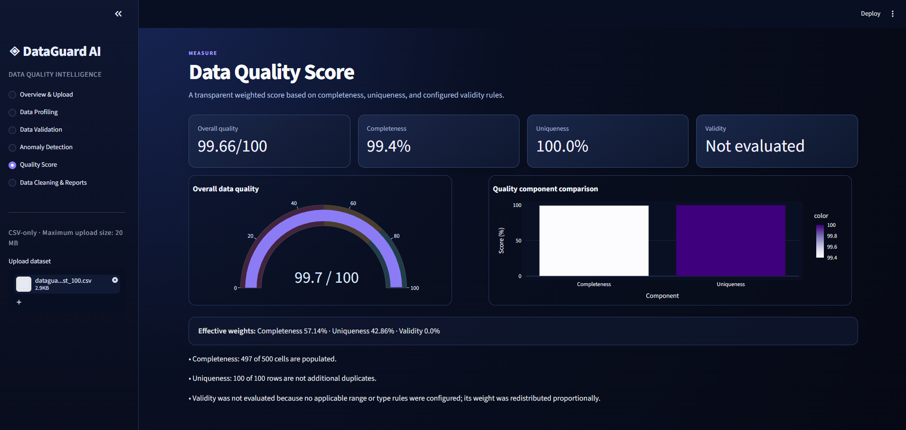

# DataGuard AI

**DataGuard AI** is a local Streamlit dashboard for reviewing CSV data quality before downstream analysis. It brings together dataset profiling, configurable validation, Isolation Forest anomaly detection, transparent quality scoring, opt-in cleaning previews, and downloadable HTML reports in one workflow.

> Built for exploratory data-quality review. Model anomalies are signals for investigation—not confirmed data errors.

## Features

- CSV-only upload workflow with a 20 MB application limit and error handling for empty, malformed, or unsupported files.
- Dataset profiling for row and column counts, data types, missing values, duplicate rows, and numerical summaries.
- Configurable data validation for missing values, duplicate rows, numerical ranges, expected data types, and inconsistent text formatting.
- Reproducible Isolation Forest anomaly detection for usable numerical features, with median imputation and safety checks for small, constant, boolean, or all-missing data.
- Transparent data-quality score built from completeness, uniqueness, and configured validation rules.
- Optional, non-mutating cleaning preview with mean/median/mode imputation and duplicate removal.
- CSV download for a generated cleaned preview and HTML download for a compact data-quality report.
- Dark, responsive SaaS-style dashboard with sidebar navigation across six analysis areas.

## Technology Stack

- **Python**
- **Streamlit** — dashboard and download workflows
- **Pandas** — CSV handling, profiling, validation, and cleaning
- **Plotly** — interactive charts and score visualizations
- **scikit-learn** — Isolation Forest anomaly detection and median imputation
- **Pytest** — automated tests

## Installation and Local Run (Windows)

Prerequisite: Python 3.10+ available as `py` in PowerShell.

```powershell
git clone https://github.com/lumoravix/DataGuard-AI.git
cd Datagaurd-AI

py -m venv .venv
.\.venv\Scripts\Activate.ps1
py -m pip install --upgrade pip
py -m pip install -r requirements.txt

streamlit run app.py
```

Open the local address printed by Streamlit, commonly `http://localhost:8501`.

If PowerShell prevents activation, use the virtual environment's Python directly:

```powershell
.\.venv\Scripts\python.exe -m streamlit run app.py
```

## Dashboard Workflow

1. **Overview & Upload** — Upload a CSV from the sidebar. The dashboard retains the dataset for the current Streamlit session and shows high-level KPIs.
2. **Data Profiling** — Review dimensions, missing values, duplicate rows, and numerical summary statistics.
3. **Data Validation** — Add optional numerical range and expected-type rules, then inspect detected quality issues and affected row indices.
4. **Anomaly Detection** — Optionally run Isolation Forest and review anomaly scores and flagged records. These records are unusual according to the model, not automatically incorrect.
5. **Quality Score** — Review the weighted completeness, uniqueness, and configured-validity score. When no applicable validity rules are configured, that weight is redistributed between completeness and uniqueness.
6. **Data Cleaning & Reports** — Explicitly generate a separate cleaned-data preview, download it as CSV, or download an HTML data-quality report for the original dataset.

## Testing

Run the complete automated suite from the repository root:

```powershell
py -m pytest
```

The test suite is organized by module and includes coverage for:

- CSV loading and invalid-upload handling
- Data profiling edge cases
- Validation rules and text/type checks
- Isolation Forest safety, reproducibility, and original-data preservation
- Quality-score components, weighting, and unavailable cases
- Cleaning operations, CSV output, and original-data preservation
- HTML report generation and escaping of unsafe user-provided text

Test outcomes depend on your local environment. Run the command above to obtain the current result; this README does not claim a specific pass count.

## Screenshots

### Overview & Dataset Upload



### ML-Based Anomaly Detection



### Data Quality Scoring



## Live Demo

**Coming Soon**

## Planned Improvements

The following are planned ideas, not current functionality:

- Deployment and hosted demo environment
- Additional validation-rule management and saved rule sets
- More anomaly-detection model options and model-comparison tooling
- Export formats beyond the current cleaned CSV and HTML report
- Authentication, collaboration, and persistent project history

## Project Structure

```text
Datagaurd-AI/
├── app.py                 # Streamlit entry point
├── dashboard.py           # Dashboard presentation layer
├── src/
│   ├── csv_loader.py
│   ├── profiler.py
│   ├── validator.py
│   ├── anomaly_detector.py
│   ├── quality_score.py
│   ├── cleaner.py
│   └── report_generator.py
├── tests/                 # Pytest suite
├── .streamlit/config.toml # Streamlit theme and upload settings
└── requirements.txt
```
